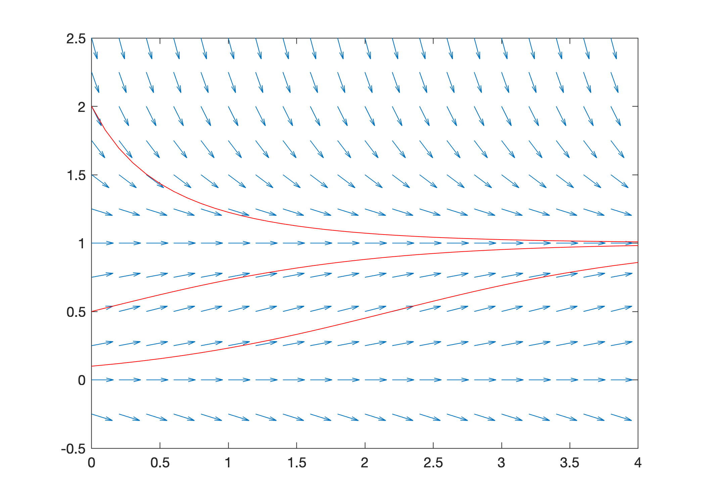

# Slope Fields

Most differential equations cannot be solved explicitly with elementary functions. So what do we do? The slope field of a first order differential equation is a graphical method for visualizing solutions. The idea is that an equation $y' = f(t,y)$ gives us complete information about the slope of a solution at any point even if we don't know a formula for the solution.

:::{seealso}
Check out [Notes on Diffy Qs (Section 1.2)](https://www.jirka.org/diffyqs/html/slopefields_section.html) to learn more about slope fields.
:::

## Creating Slope Fields

Consider a first order differential equation $y' = f(t,y)$. Create a slope field by simply drawing a small line of slope $f(t,y)$ at various points $(t,y)$ in a grid in the $ty$-plane. It is possible to sketch slope fields by hand for simple examples but it is not practical in general. Naturally, we will use MATLAB to create slope fields for any equation.

The function `slopefield.m` plots the slope field of a first order differential equation. The function takes inputs `f`, `t` and `y` where:

* `f` is a function which represents the right hand side of the differential equation $y' = f(t,y)$
* `t` is a vector of $t$ values
* `y` is a vector of $y$ values

Save the file `slopefield.m` to your MATLAB development environment (see `slopefield` below). Note that the file must be saved to the current folder.

Let's plot the slope field of the equation $y' = -ty$ over the intervals $0 \leq t \leq 4$ and $-2 \leq y \leq 2$:

```none
f = @(t,y) -t.*y;
t = 0:0.2:4;
y = -2:0.2:2;
slopefield(f,t,y);
```


The script above accomplishes the following tasks:

* Define the right hand side of the equation $y' = -ty$ as a function $f(t,y) = -ty$
* Define vector `t` of $t$ values over the interval $0 \leq t \leq 4$ using grid step size $0.2$ 
* Define vector `y` of $y$ values over the interval $-2 \leq y \leq 2$ using grid step size $0.2$ 
* Plot the direction field of the equation $y' = -ty$ over the corresponding region

## Slope Fields with Solutions

The slope field of a differential equation shows the shape of solutions. In other words, we can "see" solutions by tracing the slopes in the slope field. To make this point more clear, consider an equation where we know the exact solution and let's plot solutions with the slope field.

The general solution of the [logistic equation](https://en.wikipedia.org/wiki/Logistic_function) $y' = y(1-y)$ is given by

$$
y(t) = \frac{C e^t}{1 + C(e^t - 1)} \ , \ \ y(0) = C
$$

Plot the slope field of the logistic equation with solutions for initial conditions $y_0 = 0.1, 0.5, 2.0$. Use the command `hold on` to keep the slope field figure open and add lines to the plot.

```none
f = @(t,y) y.*(1 - y);
t = 0:0.2:4; y = -0.5:0.25:2.5;
slopefield(f,t,y), hold on

t = 0:0.1:4;
C1 = 0.1; y1 = C1*exp(t)./(1 + C1*(exp(t) - 1)); plot(t,y1,'r')
C2 = 0.5; y2 = C2*exp(t)./(1 + C2*(exp(t) - 1)); plot(t,y2,'r')
C3 = 2.0; y3 = C3*exp(t)./(1 + C3*(exp(t) - 1)); plot(t,y3,'r')
hold off
```



## More Examples

Consider the first order differential equation

$$
y' = \sin(\pi t) - \cos(\pi y)
$$

The equation is neither linear nor separable and there is no method to find a formula for the exact solution. Plot the slope field to visualize solutions.

```none
f = @(t,y) sin(pi*t) - cos(pi*y);
t = 0:0.2:5; y = -2:0.2:2;
slopefield(f,t,y)
```


## `slopefield`

```none
function slopefield(f,t,y)

[T,Y] = meshgrid(t,y);
dydt = f(T,Y);
theta = atan(dydt);
L = min(min(diff(t)),min(diff(y)))*0.8;
dy = L*sin(theta);
dt = L*cos(theta);
quiver(t,y,dt,dy,0)
axis equal; axis([t(1),t(end),y(1),y(end)]);

end
```