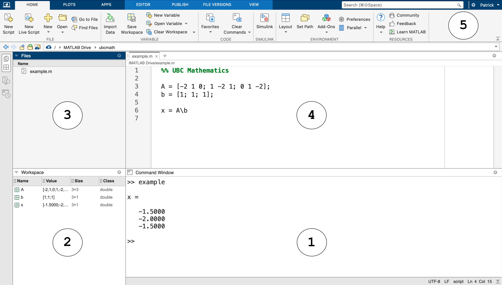

# Development Environment

Before we get into mathematical computing with MATLAB, let's take a tour of the MATLAB development environment and learn about basic commands, variables, scripts and data files.

:::{seealso}
Check out the [MATLAB documentation](https://www.mathworks.com/help/matlab/) on [Getting Started with MATLAB](https://www.mathworks.com/help/matlab/getting-started-with-matlab.html), and the [MATLAB Academy](https://matlabacademy.mathworks.com) for online courses such as [MATLAB Onramp](https://matlabacademy.mathworks.com/details/matlab-onramp/gettingstarted).
:::

## Overview

The [MATLAB](https://www.mathworks.com/products/matlab.html) development environment consists of 5 parts:

1. **Command Window**: enter commands and view output
2. **Workspace**: list of variables defined in the current environment 
3. **Files**: navigate the file system
4. **Editor**: create and edit scripts
5. **Toolbar**: create and save files and set preferences

<br>



## Command Window and Workspace

Let's do a simple example to show how to enter commands, view output and save variables. Consider the system of linear equations

$$
A \mathbf{x} = \mathbf{b}
$$

where the matrix $A$ and vector $\mathbf{b}$ are

$$
A = \left[ \begin{array}{rrr} -2 & 1 & 0 \\ 1 & -2 & 1 \\ 0 & 1 & -2 \end{array} \right] \hspace{1in} \mathbf{b} = \begin{bmatrix} 1 \\ 1 \\ 1 \end{bmatrix}
$$

Create the matrix $A$ by entering the following command at the prompt `>>` in the command window:

```none
A = [-2 1 0; 1 -2 1; 0 1 -2]
```

The output of the command is printed to the command window:

<pre class="output">
A =

    -2     1     0
     1    -2     1
     0     1    -2

</pre>

The newly created variable `A` appears in the workspace. Create the vector `b`:

```none
b = [1; 1; 1]
```

Again the output is printed to the command window and the variable appears in the workspace:
 
<pre class="output">
b =

     1
     1
     1

</pre>

Finally, compute the value `x` using the slash operator:

```none
x = A\b
```

The variable `x` is printed to the command window and the variable appears in the workspace:

<pre class="output">
x =

   -1.5000
   -2.0000
   -1.5000

</pre>

Clear the workspace with the command `clear` and clear the command window with `clc`:

```none
clear; clc;
```

## Save Code in Scripts

We can enter commands in the command window however it is good practice to save commands in a MATLAB script. A script is simply a text file containing MATLAB code and has file extension `.m`.

Let's repeat the previous example using a script instead of entering all the commands in the command window:

1. Create a new script by clicking `New Script` from the toolbar.
2. Enter the commands from the previous example in the new script appearing in the editor window.
3. Save the script by clicking `Save` in the toolbar and give the file a name such as `example.m`.
4. Run the script by clicking `Run` in the toolbar.

Note that a semicolon at the end of a command suppresses the output in the command window. Therefore we run the following script and generate the output for `x` only:

```none
A = [-2 1 0; 1 -2 1; 0 1 -2];
b = [1; 1; 1];
x = A\b
```

<pre class="output">
x =

   -1.5000
   -2.0000
   -1.5000

</pre>

Our work is saved to the file `example.m` and we can clear the workspace and command window:

```none
clear; clc;
```

:::{seealso}
Check out the MATLAB documentation to learn more about [scripts](https://www.mathworks.com/help/matlab/learn_matlab/scripts.html). 
:::

## Save Variables in Data Files

Save the variables in the workspace to a data file using the `save` command. A data file has file extension `.mat`. Let's build on the previous example and add the `save` command to our script to save the solution `x` to a data file called `example.mat`:

```none
A = [-2 1 0; 1 -2 1; 0 1 -2];
b = [1; 1; 1];
x = A\b

save('example.mat','x')
```

Run the script and note that `A`, `b` and `x` appear in the workspace as usual and the new file `example.mat` appears in the `Files` window. Clear the workspace and the command:

```none
clear; clc;
```

Finally, we can load the vector `x` from the file `example.mat` without running the script `example.m` again. Double-click the file `example.mat` in the `Files` window or use the command `load` in the command windw:

```none
load('example.mat')
```

:::{seealso}
Check out the MATLAB documentation to learn more about [`save`](https://www.mathworks.com/help/matlab/ref/save.html) and [`load`](https://www.mathworks.com/help/matlab/ref/load.html)
:::

## Submit a Data File to Canvas

<iframe style="width: 100%; height: 400px;" src="https://www.youtube.com/embed/CZ9e07y4LkA"></iframe>