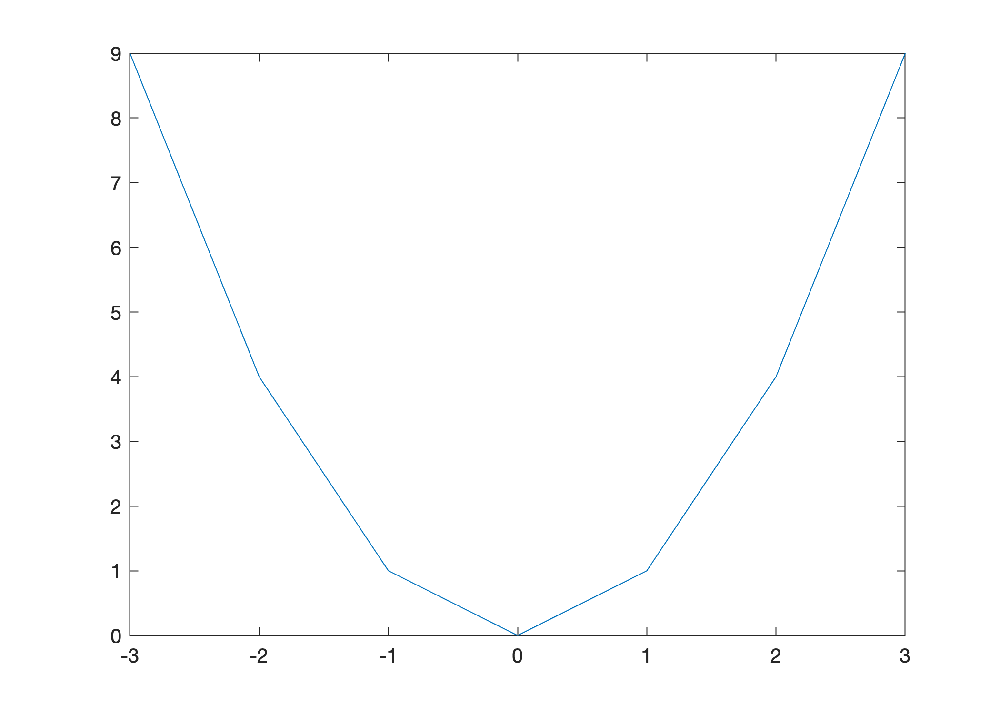
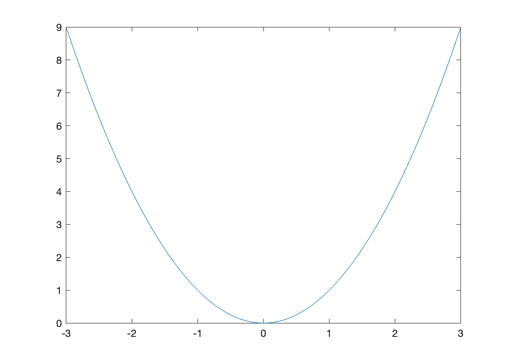
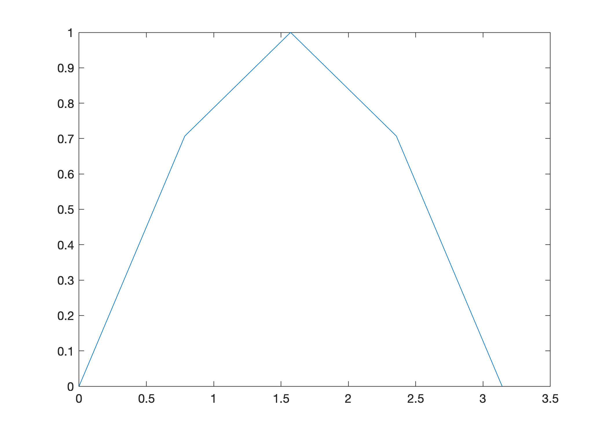

# Vectorization and Plotting

The process of applying operators and function to vectors is called *vectorization*.

:::{seealso}
Check out the MATLAB documentation to learn more about [vectorization](https://www.mathworks.com/help/matlab/matlab_prog/vectorization.html) and [plotting](https://www.mathworks.com/help/matlab/2-and-3d-plots.html).
:::

## Basic Plotting Procedure

The command `plot(x,y)` creates the line plot which connect the points defined by the vectors `x` and `y`. For example, if we would like to plot the graph of $y = x^2$ using 7 points we would run the script:

```none
x = [-3 -2 -1 0 1 2 3];
y = [9 4 1 0 1 4 9];
plot(x,y)
```



The line plot is created be several straight lines which connect the points defined by `x` and `y`. Therefore more points creates a smoother graph however manually typing several hundred entries in `x` and `y` is very inefficient. This is an instance where vectorization is very useful:

* Create a large number of $x$ values using `:` or `linspace`
* Use vector operations and functions to create the corresponding vector of $y$ values
* Plot with `plot(x,y)` and add style such as title, colors, line styles, legend, etc.

For example, let's plot $y = x^2$ on the interval $[-3,3]$ using 601 points:

```none
x = -3:0.01:3;
y = x.^2;
plot(x,y)
```



Let's take a closer look at each step in this procedure such as the operator `:` and vector operation `.^`.

## `a:h:b` and `linspace`

The colon operator `a:h:b` creates a vector of values from `a` to `b` incremented by step `h`. For example, create a vector of values from 0 to 1 with step 0.2:

```none
x = 0:0.2:1
```

<pre class="output">
x =

         0    0.2000    0.4000    0.6000    0.8000    1.0000

</pre>

The colon operator allows the user to specify the step size between points but sometimes it is helpful to specify the total number of points. The function `linspace(a,b,N)` creates a vector of values from `a` to `b` using `N` equally spaced values. For example, create a vector of 9 evenly spaced values from 0 to 1:

```none
x = linspace(0,1,9)
```

<pre class="output">
x =

         0    0.1250    0.2500    0.3750    0.5000    0.6250    0.7500    0.8750    1.0000

</pre>

The connection between `h` and `N` is given by

$$
h = \frac{b - a}{N - 1}
$$

For example, the following script creates identical vectors `x1` and `x2`:

```none
a = 0; b = 1; N = 5; h = (b - a)/(N - 1);
x1 = a:h:b
x2 = linspace(a,b,N)
```

<pre class="output">
x1 =

         0    0.2500    0.5000    0.7500    1.0000


x2 =

         0    0.2500    0.5000    0.7500    1.0000

</pre>

## Vectorized Functions

All the usual mathematical functions such as `sin`, `cos` and `exp` are *vectorized*. This means that we can apply a function to a vector and the result is the vector of function values. In other words, if $f(x)$ is a vectorized function and $\mathbf{x} = \begin{bmatrix} x_1 & x_2 & x_3 & \cdots & x_N \end{bmatrix}$ then

$$
f(\mathbf{x}) = \begin{bmatrix} f(x_1) & f(x_2) & f(x_3) & \cdots & f(x_N) \end{bmatrix}
$$

For example, the vectors `y1` and `y2` computed below are identical:

```none
x = [0 pi/4 pi/2 3*pi/4 pi];
y1 = [sin(0) sin(pi/4) sin(pi/2) sin(3*pi/4) sin(pi)]
y2 = sin(x)
```

<pre class="output">
y1 =

         0    0.7071    1.0000    0.7071    0.0000


y2 =

         0    0.7071    1.0000    0.7071    0.0000

</pre>

Plot the function $y = \sin(x)$ over the interval $[0,\pi]$ using 100 points:

```none
x = linspace(0,pi,100);
y = sin(x);
plot(x,y)
```



## Vector Operations

Addition and subtraction are already vectorized operations. We also define vectorized operations:

| Operation | MATLAB Syntax |
| :---: | :---: |
| addition | `+` |
| subtraction | `-` |
| multiplication | `.*` |
| division | `./` |
| exponentiation | `.^` |

For example, the following script creates identical vectors `y1` and `y2`:

```none
x = [-3 -2 -1 0 1 2 3];
y1 = [(-3)^2 (-2)^2 (-1)^2 0^2 1^2 2^2 3^2]
y2 = x.^2
```

<pre class="output">
y1 =

     9     4     1     0     1     4     9


y2 =

     9     4     1     0     1     4     9

</pre>
