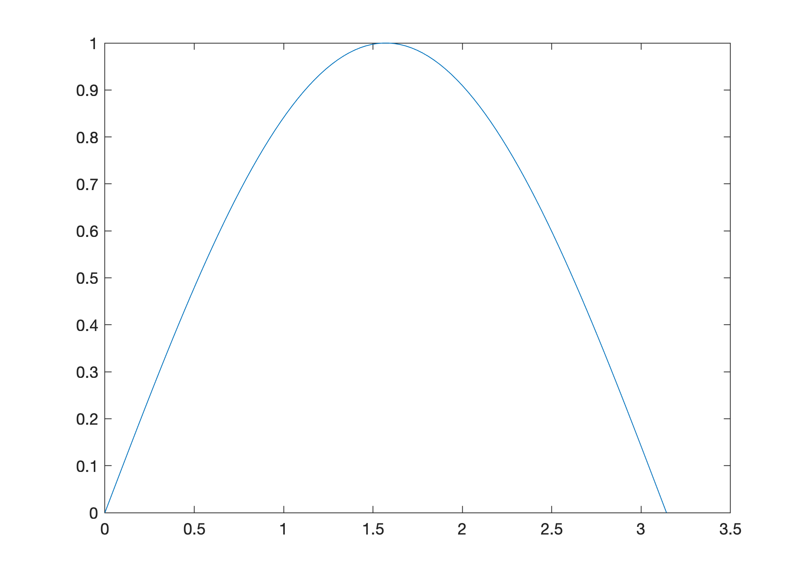
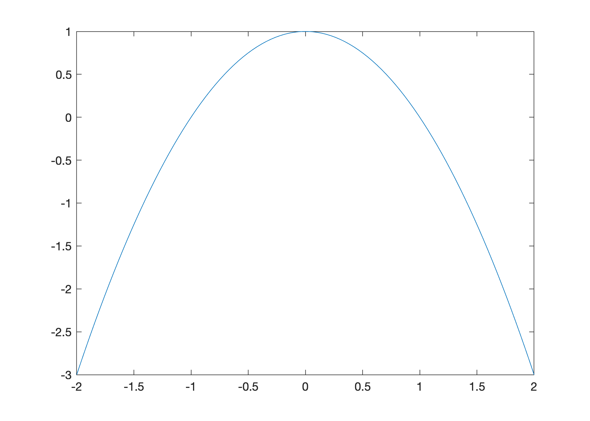
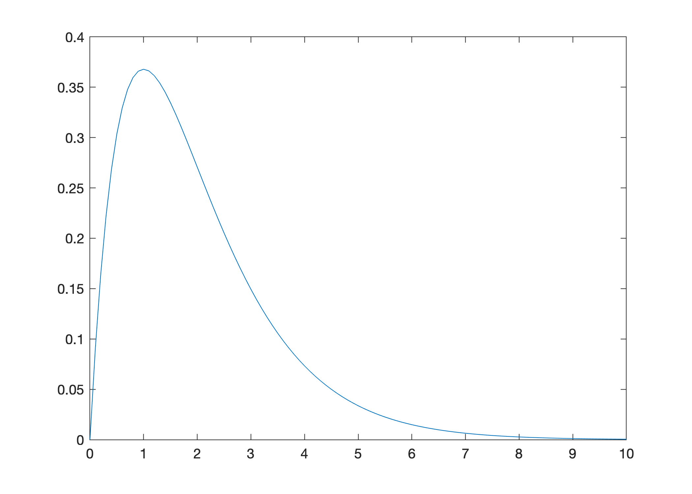
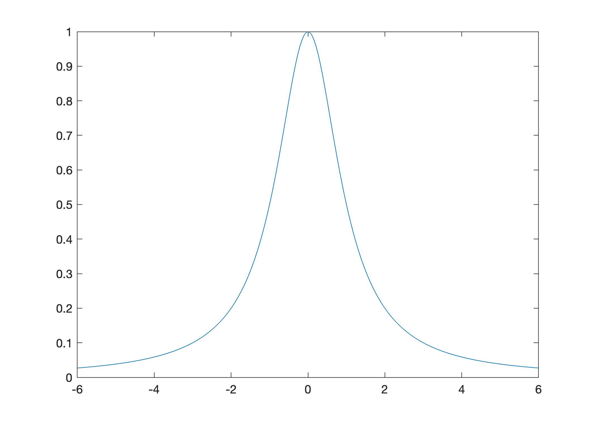
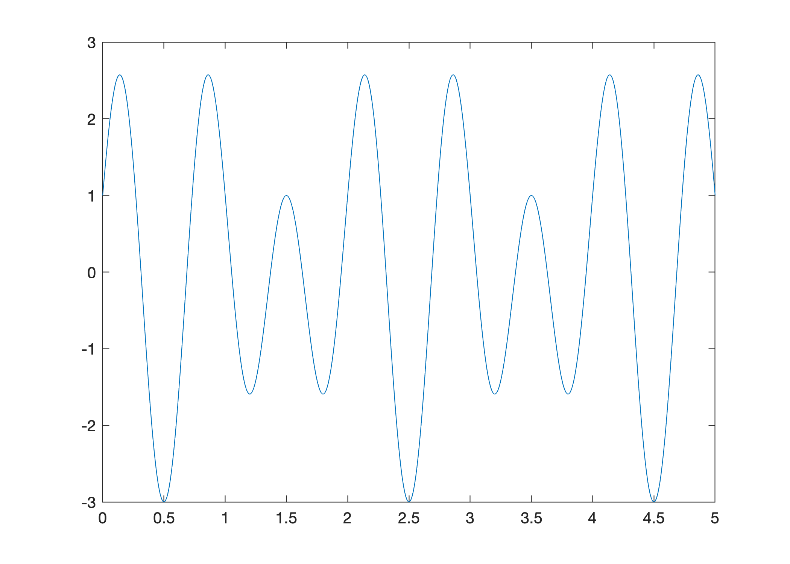

# Vectorization and Plotting

Vectorization is a fundamental concept in mathematical computing. The idea is simple but very powerful: take any function/operation $f(x)$ and apply it to a vector $\mathbf{x} = \begin{bmatrix} x_1 & x_2 & x_3 & \cdots & x_N \end{bmatrix}$ elementwise simultaneously:

$$
f(\mathbf{x}) = \begin{bmatrix} f(x_1) & f(x_2) & f(x_3) & \cdots & f(x_N) \end{bmatrix}
$$

The point is that vectorization simplifies our code and our computational thinking.

:::{seealso}
Check out the MATLAB documentation to learn more about [vectorization](https://www.mathworks.com/help/matlab/matlab_prog/vectorization.html) and [plotting](https://www.mathworks.com/help/matlab/2-and-3d-plots.html), and see [Wikipedia:Array programming](https://en.wikipedia.org/wiki/Array_programming) for a more general discussion.
:::

## Basic Plotting Procedure

To plot the graph of a function $y = f(x)$ over an interval $[a,b]$:

* Choose a finite set of increasing values $x_1 < x_2 < \cdots < x_N$ with $x_1 = a$ and $x_N = b$
* Compute the corresponding $y$ values $f(x_1),f(x_2),\dots,f(x_N)$
* Connect each pair of consecutive points by a straight line

Let's make a few simple observations. A larger number $N$ of $x$ values over the interval $[a,b]$:

* produces a smoother plot
* requires more computations to generate $y$ values
* requires more memory to store the $x$ and $y$ values

We need to use our own judgement to choose $N$ large enough so that the plot is smooth but small enough so that the amount of computation and memory required is not too big.

The MATLAB command `plot(x,y)` creates the line plot which connects the points defined by the vectors `x` and `y`. For example, the following script plots the graph of $y = x^2$ using 7 points:

```none
x = [-3 -2 -1 0 1 2 3];
y = [9 4 1 0 1 4 9];
plot(x,y)
```


We need more points to plot the function smoothly but it is inefficient to manually enter the values in the vectors `x` and `y` as we did above. Plotting is an instance where vectorization is very useful:

* Create a large number of $x$ values using `:` or `linspace`
* Use vector operations and functions to create the corresponding vector of $y$ values
* Plot with `plot(x,y)` and add style such as title, colors, line styles, legend, etc.

For example, let's use vectorization to plot $y = x^2$ on the interval $[-3,3]$ using 601 points:

```none
x = -3:0.01:3;
y = x.^2;
plot(x,y)
```


Let's take a closer look at each step in this procedure such as the operator `:` and vector operation `.^`.

## `a:h:b` and `linspace`

The colon operator `a:h:b` creates a vector of values from `a` to `b` incremented by step `h`. For example, create a vector of values from 0 to 1 with step 0.2:

```none
x = 0:0.2:1
```

<pre class="output">
x =

         0    0.2000    0.4000    0.6000    0.8000    1.0000

</pre>

In other words, the command `x = a:h:b` creates the vector $\mathbf{x} = \begin{bmatrix} x_1 & x_2 & x_3 & \cdots & x_N \end{bmatrix}$ such that

$$
x_k = a + (k-1)h
$$

For example, `0:0.05:1` creates the vector $\mathbf{x}$ of values from 0 to 1 with step 0.05:

$$
x_1 = 0.00 \ , \ \ x_2 = 0.05 \ , \ \dots \ , \ \ x_{11} = 0.50 \ , \ \dots \ , \ x_{20} = 0.95 \ , \ \ x_{21} = 1.00
$$

```none
x = 0:0.05:1;
length(x)
```

<pre class="output">
ans =

    21

</pre>

```none
x(1)
```

<pre class="output">
ans =

     0

</pre>

```none
x(2)
```

<pre class="output">
ans =

    0.0500

</pre>

```none
x(11)
```

<pre class="output">
ans =

    0.5000

</pre>

```none
x(20)
```

<pre class="output">
ans =

    0.9500

</pre>

```none
x(21)
```

<pre class="output">
ans =

     1

</pre>

The colon operator allows the user to specify the step size between points but sometimes it is helpful to specify the total number of points. The function `linspace(a,b,N)` creates a vector of values from `a` to `b` using `N` equally spaced values. For example, create a vector of 9 evenly spaced values from 0 to 1:

```none
x = linspace(0,1,9)
```

<pre class="output">
x =

         0    0.1250    0.2500    0.3750    0.5000    0.6250    0.7500    0.8750    1.0000

</pre>

The connection between `h` and `N` is given by

$$
h = \frac{b - a}{N - 1}
$$

For example, the following script creates identical vectors `x1` and `x2`:

```none
a = 0; b = 1; N = 5; h = (b - a)/(N - 1);
x1 = a:h:b
x2 = linspace(a,b,N)
```

<pre class="output">
x1 =

         0    0.2500    0.5000    0.7500    1.0000


x2 =

         0    0.2500    0.5000    0.7500    1.0000

</pre>

## Vectorized Functions

All the usual mathematical functions such as `sin`, `cos` and `exp` are *vectorized*. This means that we can apply a function to a vector and the result is the vector of function values. In other words, if $f(x)$ is a vectorized function and $\mathbf{x} = \begin{bmatrix} x_1 & x_2 & x_3 & \cdots & x_N \end{bmatrix}$ is a vector then

$$
f(\mathbf{x}) = \begin{bmatrix} f(x_1) & f(x_2) & f(x_3) & \cdots & f(x_N) \end{bmatrix}
$$

For example, the vectors `y1` and `y2` computed below are identical:

```none
y1 = [sin(0) sin(pi/4) sin(pi/2) sin(3*pi/4) sin(pi)]
x = [0 pi/4 pi/2 3*pi/4 pi];
y2 = sin(x)
```

<pre class="output">
y1 =

         0    0.7071    1.0000    0.7071    0.0000


y2 =

         0    0.7071    1.0000    0.7071    0.0000

</pre>

Let's use just these 5 points to plot $y = \sin(x)$:

```none
x = [0 pi/4 pi/2 3*pi/4 pi];
y = sin(x);
plot(x,y)
```


Clearly we need more points to plot the function smoothly. Let's use `linspace` to plot the function $y = \sin(x)$ over the interval $[0,\pi]$ using 100 points:

```none
x = linspace(0,pi,100);
y = sin(x);
plot(x,y)
```



## Vectorized Arithmetic Operations

Addition and subtraction are already vectorized operations. We also define vectorized multiplication, division and exponentiation:

| Vectorized Operation | MATLAB Syntax |
| :---: | :---: |
| addition | `+` |
| subtraction | `-` |
| multiplication | `.*` |
| division | `./` |
| exponentiation | `.^` |

For example, the following script creates identical vectors `y1` and `y2`:

```none
y1 = [(-3)^2 (-2)^2 (-1)^2 0^2 1^2 2^2 3^2]
x = [-3 -2 -1 0 1 2 3];
y2 = x.^2
```

<pre class="output">
y1 =

     9     4     1     0     1     4     9


y2 =

     9     4     1     0     1     4     9

</pre>

Use vectorization to plot $f(x) = 1 - x^2$ over the interval $[-3,3]$:

```none
x = linspace(-2,2,100);
y = 1 - x.^2;
plot(x,y)
```



Create the vector of values $y = xe^{-x}$ for $x$ from 0 to 1 with step 0.25:

```none
x = 0:0.25:1;
y = x.*exp(-x)
```

<pre class="output">

y =

         0    0.1947    0.3033    0.3543    0.3679

</pre>

The values $y_k$ in the vector $\mathbf{y}$ correspond to $x_k$ in the vector $\mathbf{x}$ by:

$$
y_k = x_k e^{-x_k}
$$

The simple code above produces the same vector as the more verbose code below:

```none
y = [0.*exp(-0) 0.25.*exp(-0.25) 0.5.*exp(-0.5) 0.75.*exp(-0.75) exp(-1)]
```

<pre class="output">
y =

         0    0.1947    0.3033    0.3543    0.3679

</pre>

Use vectorization to plot $f(x) = x e^{-x}$ over the interval $[0,10]$:

```none
x = 0:0.1:10;
y = x.*exp(-x);
plot(x,y)
```




## More Plotting Examples

Plot $f(x) = \displaystyle \frac{1}{1 + x^2}$ over the interval $[-6,6]$:

```none
x = linspace(-6,6,200);
y = 1./(1 + x.^2);
plot(x,y)
```



Plot $f(x) = \cos(2 \pi x) + 2 \sin(3 \pi x)$ over the interval $[0,5]$:

```none
x = linspace(0,5,500);
y = cos(2*pi*x) + 2*sin(3*pi*x);
plot(x,y)
```



## Exercises

**Exercise 1.** *Without running the code*, predict the values `y(1)`, `y(11)` and `y(21)` in the code below.

```none
x = -1:0.1:1;
y = 1 + x + x.^2;
```

:::{dropdown} Solution
```none
y(1),y(11),y(21)
```
<pre class="output">
ans =

     1


ans =

     1


ans =

     3

</pre>
:::

**Exercise 2.** *Without running the code*, predict the values `y(1)`, `y(51)` and `y(101)` in the code below.

```none
x = linspace(0,2,101);
y = x.*exp(-x.^2);
```

:::{dropdown} Solution
```none
y(1),y(51),y(101)
```
<pre class="output">
ans =

     0


ans =

   0.389400391535702


ans =

   0.367879441171442

</pre>

```none
0, 0.5*exp(-0.5^2), exp(-1)
```
<pre class="output">
ans =

     0


ans =

   0.389400391535702


ans =

   0.367879441171442

</pre>
:::

**Exercise 3.** Plot $f(x) = \ln(1 + x)$ over the interval $[0,10]$.

**Exercise 4.** Plot $f(x) = \arctan(x)$ over the interval $[-5,5]$.

**Exercise 5.** Plot $f(x) = 1/\sqrt(1 + x^2)$ over the interval $[4,4]$.

**Exercise 6.** Plot $f(x) = e^{\sin(x)}$ over the interval $[0,4\pi]$.